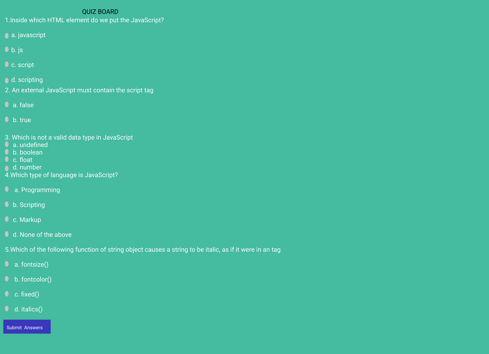

# QUIZ BOARD

##### By Catherine Wangui
### It is a description of my website which contain a quiz board

## Table of Content

+ [Description](#description)
+ [Installation Requirement](#Installation)
+ [Technology Used](#technology-used)
+ [Reference](#reference)
+ [Licence](#licence)
+ [Authors Info](#author-Info)

## Description

This is a website that the students will take a test on Javascript.They will answer the multiple choice questions on the website, and after submitting their answers, they will know what they scored.

## Installation

### Requirements

* Either a computer, phone, tablet or an Ipad

* An access to the Internet

### Installation Process

## Technology Used
* HTML - which was used to build the structure of the pages.

* CSS - which was used to style the pages incuding the left aside navigation bar
* Javascript - which was used to add interactive behavior to the webpage.

## Reference
* YouTube
* Moringa School Canvas
* https://www.figma.com/file/ovoUtmkDQT6CgGBxrqmPIi/QUIZ-BOARD?node-id=1%3A2

## Licence

## Authors Info
Linked - [Catherine Wangui](https://www.linkedin.com/in/catherine-wangui-721789176/)